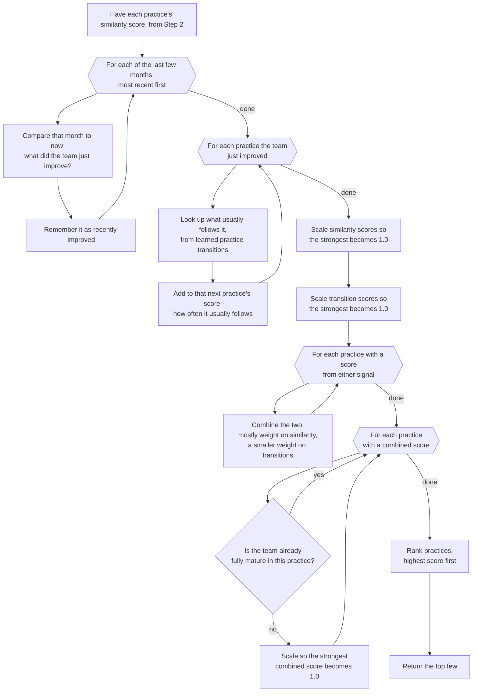

# Flowchart — Blend Similarity + Practice Transition Scores → Ranked Recommendations

Steps 3–6 of `RecommendationEngine.recommend()`: takes the per-practice `similarity_scores` built in
Step 2 (see `/ranked-similar-teams`), adds a practice-transition boost from the target team's own recent
improvements, blends the two signals into one score per practice, then filters and ranks them into
the final top-N recommendation list.

**Location**: `src/ml/recommender.py:213-299`

## Notes

- **"What did the team just improve?" — `recommender.py:217-235`**: this looks at the *target*
  team's own history (past N months vs. current month), not the similar teams' — it's a separate
  signal from Step 2's collaborative-filtering pass. A practice is only remembered once even if it
  improved in multiple of the checked months (`recommender.py:234`, backed by a `set` in code).
- **"Look up what usually follows it" — `recommender.py:242-251`**: this queries the same learned
  transition table built in `/learn-sequences-up-to-month`, capped to each practice's top 3 typical
  follow-ons (`top_n=3`, `recommender.py:246`). If a recently improved practice has no learned
  transition pattern yet, that lookup is skipped rather than treated as an error (`recommender.py:249-251`).
- **Iteration order (not pictured)**: in code, both loops over "practices with a score" walk the
  canonical practice list rather than a raw `set`/dict, because plain `set()` iteration order
  depends on the process's hash seed — without this, tied scores (and therefore the final ranking)
  would not be reproducible across runs (`recommender.py:242, 270`).
- **"Combine the two: mostly weight on similarity..." — `recommender.py:274`**: the exact formula is
  `similarity_weight × normalized similarity + (1 − similarity_weight) × normalized transition`, default
  `similarity_weight = 0.7` (70/30 split). The per-team similarity loop variable in Step 2 used to be
  named `similarity_weight`, silently shadowing this function's own parameter before this line ever
  read it — so the blend ratio was never actually tunable. It's now named `peer_similarity` (see
  `/ranked-similar-teams` and `docs/known-issues/01-similarity-weight-shadowing.md`); this diagram
  reflects the fixed behavior, where `similarity_weight` genuinely controls the blend.
- **Two separate scaling passes — `recommender.py:258-265` then `280-291`**: similarity and transition
  scores are each scaled to their own max *before* combining (so neither signal dominates just
  because it has a larger raw scale), and then the combined score is scaled *again* by its own max
  afterward. All three scaling steps default to `0.0` if the corresponding max is `0`.
- **"Already fully mature?" — `recommender.py:287-288`**: checked against the *current* maturity
  level (`current_level >= 1.0`), not the computed score — a practice a team has already fully
  adopted is never recommended again, regardless of how strong its combined score is.
- **Final tie-break — `recommender.py:297`**: ranks by score, and ties fall back to alphabetical
  practice name rather than insertion order, so the returned ranking is deterministic.
- **Formulas**: see the Hybrid scoring section in `/domain-ml` for the exact weighted-average
  formula and default parameter values (`similarity_weight=0.7`, `recent_improvements_months=3`).

Citations current as of this session; re-verify against `recommender.py` if the implementation changes.
