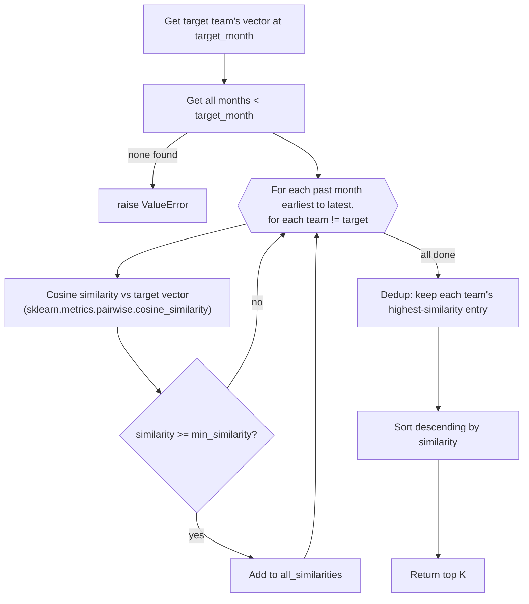

# Flowchart — `SimilarityEngine.find_similar_teams`

Finds the K teams most similar to a target team at a given month, by comparing practice-maturity
vectors via cosine similarity. Used by `RecommendationEngine.recommend()` (and
`get_recommendation_explanation()`) as one half of the hybrid scoring signal — the other being
`SequenceMapper`.

**Location**: `src/ml/similarity.py:21`

## Notes

- **"Cosine similarity vs target vector" — `similarity.py:75-79`**: captures whether two teams have
  the same relative strengths/weaknesses pattern across practices, independent of their overall
  maturity level — it's not about the same maturity or the same differences between practices.
  Cosine similarity is standard in collaborative filtering because it compares patterns, not scale —
  like recognizing two critics agree even if one rates everything lower. Research shows this gives
  more accurate recommendations than Euclidean distance, especially with many features, where
  Euclidean distance struggles to tell similar and dissimilar cases apart.

Citations current as of this session; re-verify against `similarity.py` if the implementation changes.
