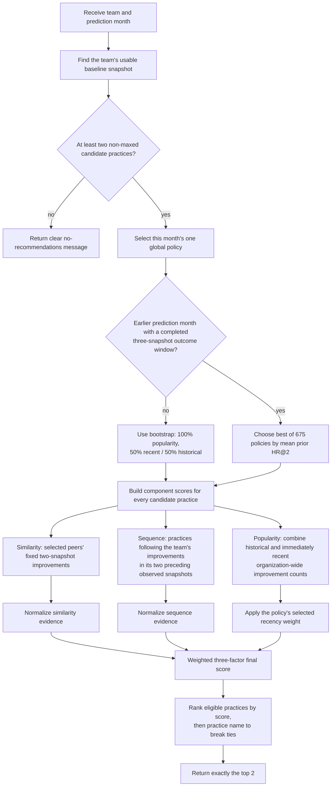

# Flowchart — Global Three-Factor Policy Blend → Ranked Recommendations

`PolicyEngine` produces the primary recommendations.  For a prediction month it selects one
global policy, then uses that same policy for every recommendable team in the month.  The policy
combines similarity, sequence, and time-aware popularity evidence; it is not a fixed 70/30 blend
and callers cannot tune it per request.

**Location**: `src/ml/policy.py` (`select_policy()`, `score_case()`, and `top_practices()`)

## Notes

- **One policy for a month, not a team.** A policy contains peer count, minimum similarity,
  similarity / sequence / popularity weights, and popularity recency weight. The candidate grid is
  `3 × 3 × 15 × 5 = 675` policies. `select_policy()` uses only completed earlier prediction-month
  outcomes; when none exist, it uses the stated bootstrap policy.
- **Fixed component windows.** Similarity examines at most the next two observed peer snapshots,
  without going past the target baseline. Sequence uses the target team's two preceding observed
  snapshots. Only the policy weights and peer parameters can change month to month.
- **Research-exact normalization.** Similarity and sequence evidence are normalized before the
  candidate mask. Historical popularity is masked then normalized; recent popularity is normalized
  organization-wide then masked. See `PolicyEngine.score_case()` for the precise implementation.
- **No peers is not an error.** If a selected threshold leaves no peers, similarity is zero while
  sequence and popularity still rank the two recommendations.
- **Factor weights always sum to 100%.** They are selected from the 15 combinations using
  0%, 25%, 50%, 75%, and 100% increments.
