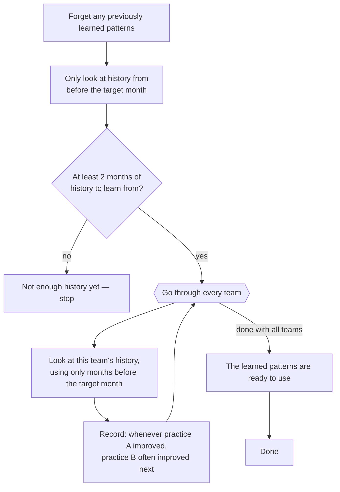

# Flowchart — `SequenceMapper.learn_sequences_up_to_month`

Learns first-order practice transition patterns (practice A improved → practice B typically follows)
using only months strictly before `max_month`, so no learned transition can straddle the boundary
being evaluated. Called from `RecommendationEngine.recommend()` /
`get_recommendation_explanation()` and from `BacktestEngine` before scoring each test month — it is
the time-limited counterpart to `learn_sequences()`, which uses all available history.

**Location**: `src/ml/sequences.py:121`

> Simplified for clarity: the real implementation also memoizes results per `max_month` in
> `self._sequence_cache` (a pure performance optimization, since this method is called repeatedly
> with the same `max_month` during backtesting/optimization). This diagram shows the always-fresh
> computation path — see `sequences.py:133-141, 170-176` for the caching wrapper around it.

## Notes

- **"Only look at history from before the target month" — `sequences.py:151`**: this is what keeps
  the model honest — it can never peek at the outcome it is evaluating. Only improvements that
  actually happened before the month being evaluated are allowed to shape what gets learned. The
  same check is applied a second time per team (`sequences.py:164`), so nothing from the target
  month or later can sneak in.
- **"Record: whenever practice A improved, practice B often improved next" — `sequences.py:82-119`**:
  for each team, the system steps through the points in its history where at least one practice
  improved, and pairs up two consecutive such points — every practice that improved at the earlier
  point is paired with every practice that improved at the later point, and each pairing counts as
  one observed "A then B" sequence. Practices that improved together at the same point aren't paired
  with each other, since there's no way to know which of them came first. ("Next" means the next
  point where something improved, not necessarily the next calendar month.)
- **"The learned patterns are ready to use" — `sequences.py:168`**: what comes out of all this is,
  for every practice that was ever improved, a short list of "what usually comes next" — the other
  practices that tended to improve right after it, ranked by how often that actually happened.
  Nothing is guessed or filled in: if a pairing was never seen anywhere in the data, it simply isn't
  in the list, rather than being treated as unlikely.
- **Turning those counts into percentages — `sequences.py:178-204`**: this happens later, in a
  separate step, whenever something actually asks "what usually comes after practice A?" (this is
  outside the diagram above, which only covers building up the counts). The percentage for each
  "next" practice is just its count divided by the total of everything ever seen following practice
  A — not compared against the whole dataset. For example, if CI/CD followed Test Automation 6
  times, Code Review followed it 3 times, and Pair Programming followed it once, then CI/CD's
  likelihood is 6 out of 10 (60%), Code Review's is 30%, and Pair Programming's is 10%. If nothing
  was ever observed following a practice, no percentages are produced for it at all.

Citations current as of this session; re-verify against `sequences.py` if the implementation changes.
