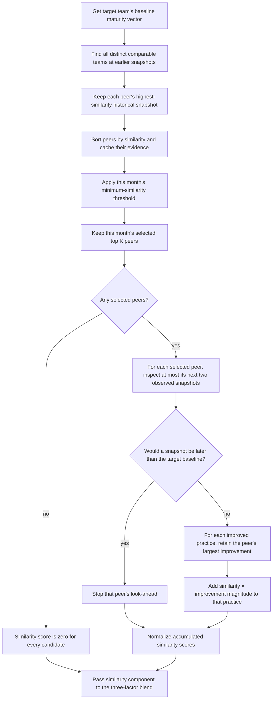

# Flowchart — Comparable Peers → Similarity Component Score

The similarity component is prepared by `PolicyEngine` and scored under the peer count and
minimum-similarity threshold selected for the prediction month. It is one of three components in
the final blend; it does not by itself decide the recommendations.

**Location**: `src/ml/policy.py` (`_compute_components()`, `_selected_peer_indices()`, and
`score_case()`)

## Notes

- `SimilarityEngine.find_similar_teams()` searches only snapshots before the baseline and returns
  `(team, similarity, historical_month)` tuples. `PolicyEngine` initially retains all available
  peers so that each monthly policy can apply its own `K` and threshold without recomputing them.
- `K` is one of 5, 10, or 19; the threshold is 0.00, 0.50, or 0.75. Both are global settings for
  the prediction month, selected alongside the blend weights.
- The two-snapshot peer look-ahead is fixed. It must never use a peer observation later than the
  target team's baseline, which prevents future information from influencing the score.
- A peer may contribute to several practices, but contributes only its largest observed improvement
  for each practice in that look-ahead window. Contributions from different peers accumulate.
