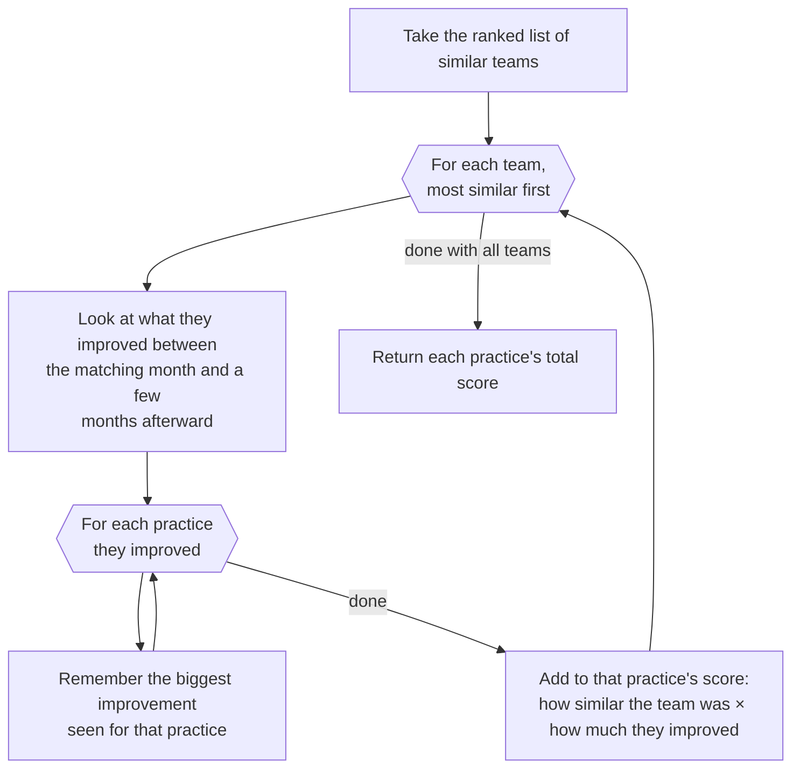

# Flowchart — Ranked Similar Teams → Similarity Scores

Step 2 of `RecommendationEngine.recommend()`: consumes the ranked, deduplicated list returned by
`SimilarityEngine.find_similar_teams()` (see `/find-similar-teams` flowchart) and converts it into
per-practice `similarity_scores` — the collaborative-filtering half of the hybrid score that Step 4
later blends with `SequenceMapper`'s sequence scores.

**Location**: `src/ml/recommender.py:159-211`

## Notes

- **Happy path only.** This diagram shows the case where a similar team has usable data and
  improved at least one practice. The real code (`recommender.py:159-211`) also handles: a team
  missing data for the month it matched on, running out of future months to check, and a
  months-ahead window not showing an improvement for a given practice — each of those simply skips
  ahead without adding to any score (`recommender.py:164-165, 180-181, 196`).
- **"Look at what they improved... a few months afterward" — `recommender.py:173-206`**: this
  hides a data-leakage guard that's worth knowing about even though it's not drawn: the "few months
  afterward" window (`similar_teams_lookahead_months`, default 3) never looks past the month
currently being evaluated for recommendations — the same rule enforced in `learn_sequences_up_to_month` (see
  `/learn-sequences-up-to-month`). It's checked separately for every similar team, since each team's
  own "matching month" differs.
- **"Remember the biggest improvement seen" — `recommender.py:200-205`**: improvements don't
  happen on a fixed cadence, so the window is checked month by month and only the *largest*
  improvement per practice is kept — not summed — to avoid double-counting the same underlying
  improvement if it still shows up as a smaller delta in a later month.
- **"Add to that practice's score: how similar × how much they improved" — `recommender.py:209`**:
  this adds to a running total rather than overwriting it, so if multiple similar teams improved the
  same practice, their weighted contributions accumulate — a practice improved by many close peers
  outranks one improved by a single close peer or by many distant ones. The "how similar" weight is
  the same similarity score already computed and ranked when finding similar teams (see
  `/find-similar-teams`); this step never re-ranks the teams, it only spends the ranking as a weight.
- **Exception handling (not pictured)**: the whole per-team body is wrapped in
  `try/except (KeyError, ValueError, IndexError): continue` (`recommender.py:160, 210-211`), so a
  malformed or incomplete history for one similar team is skipped without aborting the loop for the
  rest.
- **Output feeds Step 4**: `similarity_scores` is normalized (divided by its own max) and blended
  with `sequence_scores` via `similarity_weight` — see the Formulas section in `/domain-ml`.

Citations current as of this session; re-verify against `recommender.py` if the implementation changes.
