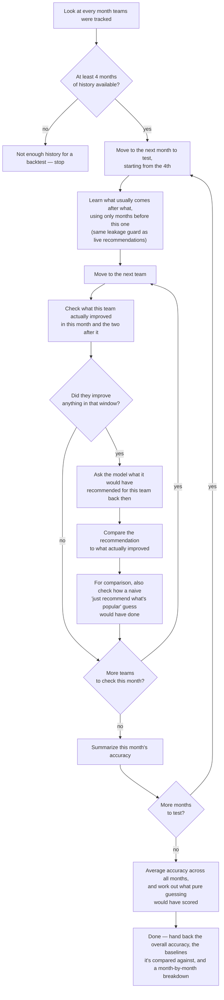

# Flowchart — `BacktestEngine.run_backtest`

Answers "how good is the model, really?" by replaying history: for every past month, it generates
likely next-practice recommendations the same way a live recommendation would, then checks them against what teams actually
went on to improve. This is the engine behind UC-02 (Run Backtest Validation) — see
`docs/sequence-diagrams/02-run-backtest.md` for how it fits into the request/response round trip
with the Backtest tab.

**Location**: `src/validation/backtest.py:89`

> Simplified for clarity: the real implementation also checks for cancellation (once per month and
> every 10 teams), skips teams whose data doesn't line up (missing prev/test month), and tracks
> extra rank-aware metrics (precision@N, recall@N, MRR) alongside the headline accuracy shown here.
> This diagram shows the core happy-path logic — see `backtest.py:212-424` for the full loop.

## Notes

- **"At least 4 months of history available?" — `backtest.py:181-182`**: the rolling window needs
  at least 3 months of runway before the first test month, so a backtest simply can't start with
  fewer than 4 months of data. If there isn't enough, the whole run stops immediately with an
  error rather than producing a partial or misleading result.
- **"starting from the 4th" — `backtest.py:212`**: the first 3 months are never tested directly —
  they only ever serve as training history for later months. The 4th month is the earliest one
  with enough "before" data to make a fair recommendation evaluation.
- **"Learn what usually comes after what... using only months before this one" —
  `backtest.py:253`**: this is the same temporal leakage guard used everywhere else in the system
  (see `/domain-validation` and the `learn-sequences-up-to-month` flowchart) — the model is never
  allowed to learn from, or be judged against, data from the month it's currently being tested on
  or later.
- **"Check what this team actually improved... in this month and the two after it" —
  `backtest.py:300-331`**: a 3-month window, not just the test month itself, because teams don't
  always act on a recommendation immediately — this gives credit for improvements that show up
  with a bit of lag, matching how the live recommendation logic looks ahead too.
- **"Did they improve anything in that window?" — `backtest.py:337-338`**: teams that improved
  nothing at all in the 3-month window are skipped for this case, not scored as a miss. There was
  nothing for any recommendation to have caught, so it isn't counted as evidence the model failed.
- **"Ask the model... recommended for this team back then" — `backtest.py:351-361`**: this calls
  the exact same hybrid recommender used for live recommendations (see `/domain-ml`), fed only the
  team's state as of the month right before the test month — it has no more information than a
  real recommendation would have had at that point in time.
- **"For comparison, also check how a naive 'just recommend what's popular' guess would have done"
  — `backtest.py:374-386`**: computed for free alongside the real check, using data already on
  hand — no extra pass over the data is needed. This gives a stronger sanity check than random
  guessing: if the model can't beat "just recommend whatever improves most often everywhere," its
  per-team personalization isn't adding value.
- **"Summarize this month's accuracy" — `backtest.py:404-423`**: each month's own hit rate is
  calculated before moving to the next month, so the per-month breakdown shown to the analyst is
  built up incrementally, not reconstructed at the end.
- **"Average accuracy across all months, and work out what pure guessing would have scored" —
  `backtest.py:426-490`**: both the headline accuracy and the random-guess baseline it's compared
  against are averaged the same way — month-by-month, then averaged across months — so the two
  numbers are built consistently and can be validly compared (see
  `docs/known-issues/04-accuracy-vs-baseline-aggregation-mismatch.md` for why that consistency
  needed a deliberate fix).

- **"Done — hand back the overall accuracy..." — `backtest.py:500-529`**: what the analyst
  actually sees on the Backtest tab comes from this returned bundle:
  - **Headline numbers**: overall accuracy, the random-guess baseline, and the popularity-guess
    baseline, plus how much better the model did than each one (as both a gap and a "×
    better than random" factor)
  - **Supplementary numbers**: precision@N, recall@N, and MRR, each with its own baseline and
    improvement factor — more detailed than the headline accuracy, but not what's shown by default
  - **Totals**: how many recommendation cases were evaluated in total, how many were validated, how many distinct
    teams were tested, and the average number of practices a team improved per case
  - **Per-month breakdown**: one row per tested month — recommendations evaluated, validated, accuracy,
    popularity-baseline accuracy, precision, recall, MRR, and teams tested that month — this is
    what fills the table on the Backtest tab
  - **`cancelled`**: `false` on a full run; the analyst never sees a partial result on the happy
    path shown here (see the "simplified for clarity" note above for the cancellation flow)

Citations current as of this session; re-verify against `backtest.py` if the implementation changes.
