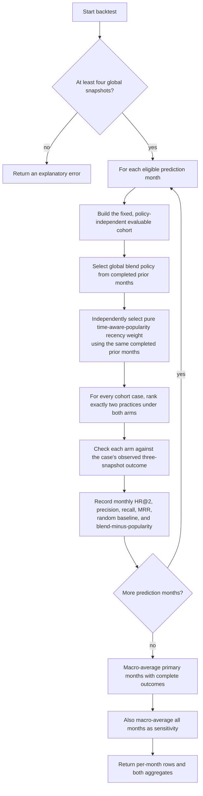

# Flowchart — `BacktestEngine.run_backtest`

The backtest replays the same global monthly policy that the live recommendation flow would have
selected at each point in history. It reports the selected blend beside an independently selected,
pure time-aware-popularity comparison arm.

**Location**: `src/validation/backtest.py`

## Notes

- **Fixed cohort first.** A case must be recommendable (at least two non-maxed practices) and show
  at least one observed improvement in its outcome window. This decision is made before scoring
  and is identical for every one of the 675 policies and both comparison arms.
- **Walk-forward selection.** A prior prediction month can inform the current policy only once its
  full three-snapshot outcome window ended before the current prediction month. Before any such
  month exists, both arms use the 100%-popularity 50/50-recency bootstrap policy.
- **Fair comparator.** The popularity arm uses 0% similarity and 0% sequence, but selects its own
  recency weight from the same completed prior months. It is not the retired static-popularity
  baseline.
- **Primary versus sensitivity.** Primary results include only months with a complete outcome
  window; sensitivity results include every prediction month and remain separately labelled.
