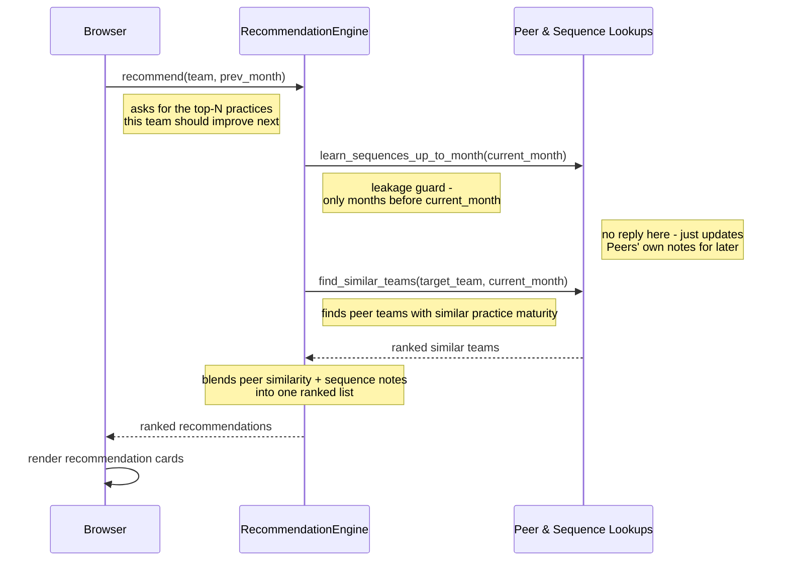

# Flow 1 — Get Recommendations

Generates a ranked list of practices a specific team should improve next for a given month, by
blending peer-team similarity with learned improvement sequences. This is UC-01, the core
analyst-facing prediction flow that the other flows exist to validate and tune.

**Trigger**: user selects a team + month on the Recommendations tab, clicks "Get Recommendations."

**Participants**: `Browser` (stands in for the click → app.js → api.js → FastAPI Route →
APIService request/response round trip, collapsed out of this diagram — see notes), plus two
backend modules: `RecommendationEngine`, and `Peer & Sequence Lookups` — a grouping of
`SimilarityEngine` and `SequenceMapper`, the two lookups `RecommendationEngine` always calls
together (see notes).

**Configuration parameters in this flow** (passed from the frontend request into `recommend()`,
elided from the diagram itself):
- `top_n` — how many recommendations to return (hardcoded to `2` by the frontend).
- `k_similar` — how many peer teams to consider when computing similarity-based scores (hardcoded
  to `19` by the frontend).
- `min_similarity_threshold` — the minimum cosine similarity a team must have to be counted as a
  peer at all (defaults to `0.75`, set server-side in `APIService`).

`recommend()` also uses three more tunables internally — `similarity_weight`, an weighting of
similarity vs. sequence signal in the final score; `similar_teams_lookahead_months`, how many
months ahead to check a peer for improvements; and `recent_improvements_months`, how many months
back to look for a team's own recent improvements — but this flow doesn't expose them, so they run
at their function defaults. They only become configurable via Flow 2 (Run Backtest) and Flow 3 (Run
Parameter Optimization).

## Notes

- **Collapsed layer**: `app.js`, `api.js`, `FastAPI Route`, and `APIService` are intentionally left
  out as separate lifelines to keep this diagram focused on the ML drill-down. `Browser` stands in
  for that whole round trip — every arrow touching `Browser` above is really mediated by that chain:
  click handler (`app.js:294` → `loadRecommendations()` `app.js:521`) → `api.js:47-64` (POST
  `/api/recommendations`) → `routes.py:98-104` → `APIService.get_recommendations()`
  (`service.py:204-217`, which computes `prev_month` before calling `recommend()`).
- **Why "Peer & Sequence Lookups" is one lifeline, not two**: `RecommendationEngine` never calls
  `SimilarityEngine` or `SequenceMapper` in isolation — every path through `recommend()` (and
  `get_recommendation_explanation()`) calls `learn_sequences_up_to_month()` immediately followed by
  `find_similar_teams()`, one right after the other, with no branching between them. Grouping them
  keeps the diagram to 3 lifelines without losing any real call structure; `similarity.py:21` and
  `sequences.py:121` are the individual methods if you need the class-level detail.
- **Two pieces of `APIService` logic never touch the ML engines, so they don't appear as arrows
  above** — worth knowing about even though they're off-diagram:
  - After `recommend()` returns, `APIService` independently recomputes ground truth by checking
    `month`, `month+1`, `month+2` for actual improvements (`service.py:219-335`). This happens
    *after* the recommendation is generated and doesn't influence it — it's purely for the "was
    this a hit?" badge shown in the UI, not part of the prediction itself.
  - `APIService._get_practice_profile(team, month)` (`service.py:680`) builds the level-0…3
    maturity breakdown shown alongside the recommendations.
- **Omitted from this diagram**: after the ranked list is returned, `Browser` calls
  `get_recommendation_explanation(...)` once per recommendation to build the "why" text shown in
  the UI (triggered by `service.py:363-369`, failures silently swallowed at `service.py:388`). It's
  left out not because it's logic-free — it re-invokes the same two ML lookups
  (`learn_sequences_up_to_month` — `recommender.py:337`, `find_similar_teams` — `recommender.py:380`)
  — but because that invocation is a duplicate/redundant lookup done purely to generate explanation
  text; its output doesn't feed back into the ranking already produced by the single `recommend()`
  call (`recommender.py:141,144-146`) above.

Citations current as of this session; re-verify against `app.js`, `api.js`, `routes.py`,
`service.py`, `recommender.py`, `similarity.py`, `sequences.py` if the implementation changes.
