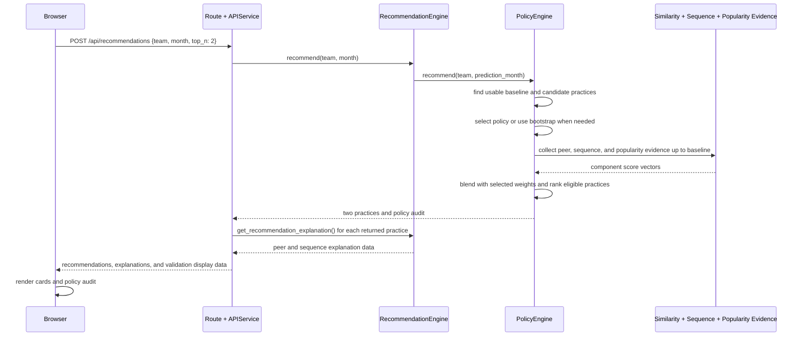

# Flow 1 — Get Recommendations

Generates exactly two ranked practices for one team and prediction month. The request has no
model-tuning parameters: `PolicyEngine` is the single configuration authority and selects the
same global policy for every eligible team in that prediction month.

**Trigger**: the user selects a team and month on the Recommendations tab and clicks **Get
Recommendations**.

## Notes

- The public request pins `top_n` to 2. Any other value, and old fields such as peer count or
  similarity threshold, are rejected rather than becoming per-request configuration.
- `select_policy()` chooses peer count, similarity threshold, the three factor weights, and
  popularity recency weight once per prediction month. It uses only earlier prediction months with
  completed three-snapshot outcomes.
- Evidence is time-bounded at the baseline: similarity uses earlier comparable snapshots and a
  fixed two-snapshot peer look-ahead; sequence learns only from observations before the baseline;
  popularity combines historical counts with the immediately preceding transition.
- When no selected peer remains, similarity contributes zero. Sequence and popularity still rank
  the two recommendations, and the response explains that no comparable peer was found.
- If the team has fewer than two eligible practices at its baseline, the same flow returns an empty
  recommendation list and a clear message instead of the two-practice result shown in the diagram.
