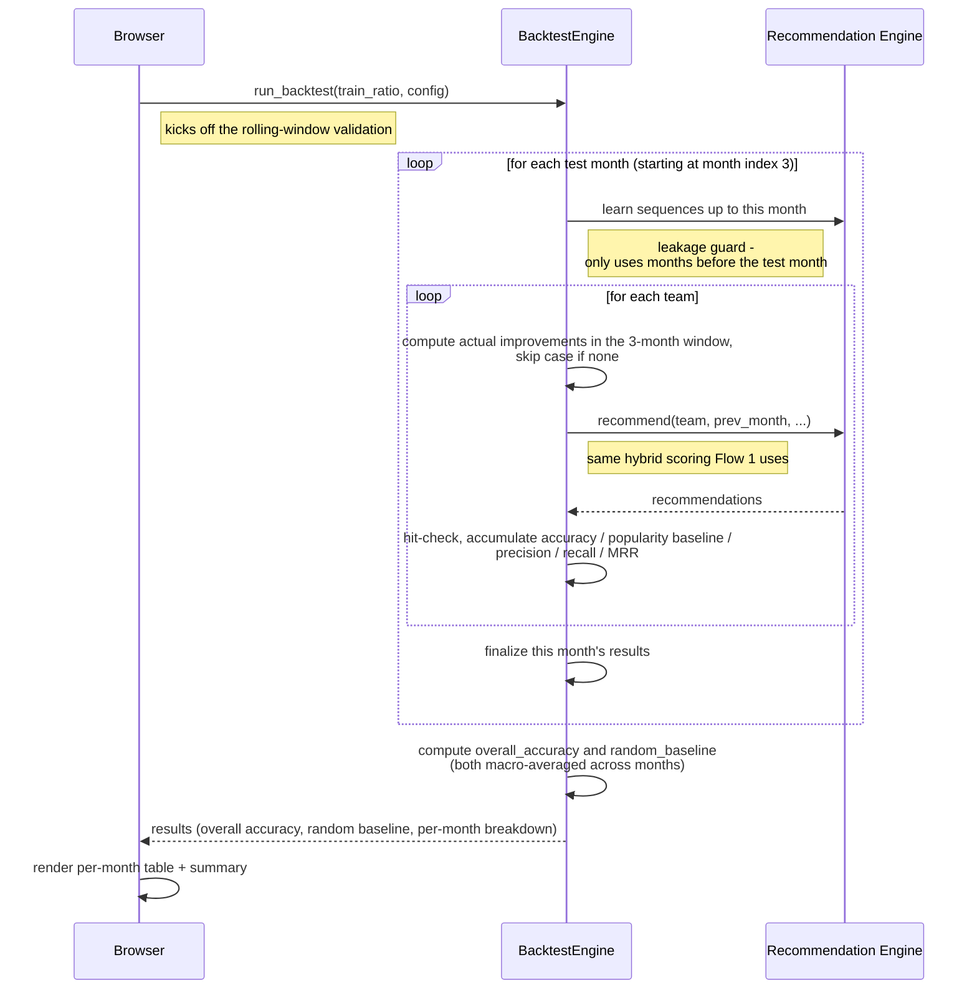

# Flow 2 — Run Backtest Validation

Measures how accurate the recommendation model actually is by replaying history: for every past
month it generates predictions the same way Flow 1 does, then checks them against what teams
really improved. This is UC-02, the analyst's way of validating the model before trusting it.

**Trigger**: user configures parameters (or uses defaults) on the Backtest tab, clicks "Run Backtest."

**Participants**: `Browser` (stands in for the click → app.js → api.js → FastAPI Route →
APIService request/response round trip, collapsed out of this diagram — see notes), plus two
backend modules: `BacktestEngine`, and `Recommendation Engine` — a grouping of
`RecommendationEngine` and `SequenceMapper`, the same pair `BacktestEngine` drives together on
every test month (see notes; this is the same predictor Flow 1 uses).

## Notes

- **Collapsed layer**: `app.js`, `api.js`, `FastAPI Route`, and `APIService` are intentionally left
  out as separate lifelines. `Browser` stands in for that whole round trip on both ends of the
  diagram: click handler (`app.js:335-337` → `runBacktest()` `app.js:940`, config built
  `app.js:913-922`) → `api.js:77-100` (POST `/api/backtest`) → `routes.py:116-125` →
  `APIService.run_backtest()` (`service.py:452-464`, normalizes config then calls
  `BacktestEngine`); response rendered by `displayBacktestResults()` (`app.js:997-1265`).
- **Why "Recommendation Engine" is one lifeline, not two**: `BacktestEngine` calls
  `SequenceMapper.learn_sequences_up_to_month()` directly once per test month
  (`backtest.py:253`), then calls `RecommendationEngine.recommend()` once per team
  (`backtest.py:351-361`) — and `recommend()` itself immediately re-calls that same
  `learn_sequences_up_to_month()` internally (see Flow 1). Since `BacktestEngine` always drives
  both together, on the same cadence, grouping them keeps this diagram to 3 lifelines without
  losing any real call structure.
- **The `loop`-within-`loop` (months, then teams-within-month) is the whole point of this diagram**
  — don't flatten it into a linear sequence (`backtest.py:212` outer loop, `:266` inner loop). The
  nesting is what shows why a full backtest run can take a while.
- **Popularity baseline** is computed inline inside the per-team loop (`backtest.py:364-392`),
  right alongside the real model's hit-check, reusing `sequence_mapper.get_improvement_frequency()`
  which is already populated as a side effect of the `recommend()` call that just ran
  (`backtest.py:351-361`) — no extra learning pass is needed to compute it.
- Per-month finalization is `backtest.py:403-423`; `overall_accuracy` and `random_baseline` are
  computed once after the outer loop, at `backtest.py:426-440` and `:442-484` respectively.

Citations current as of this session; re-verify against `app.js`, `api.js`, `routes.py`,
`service.py`, `backtest.py` if the implementation changes.
