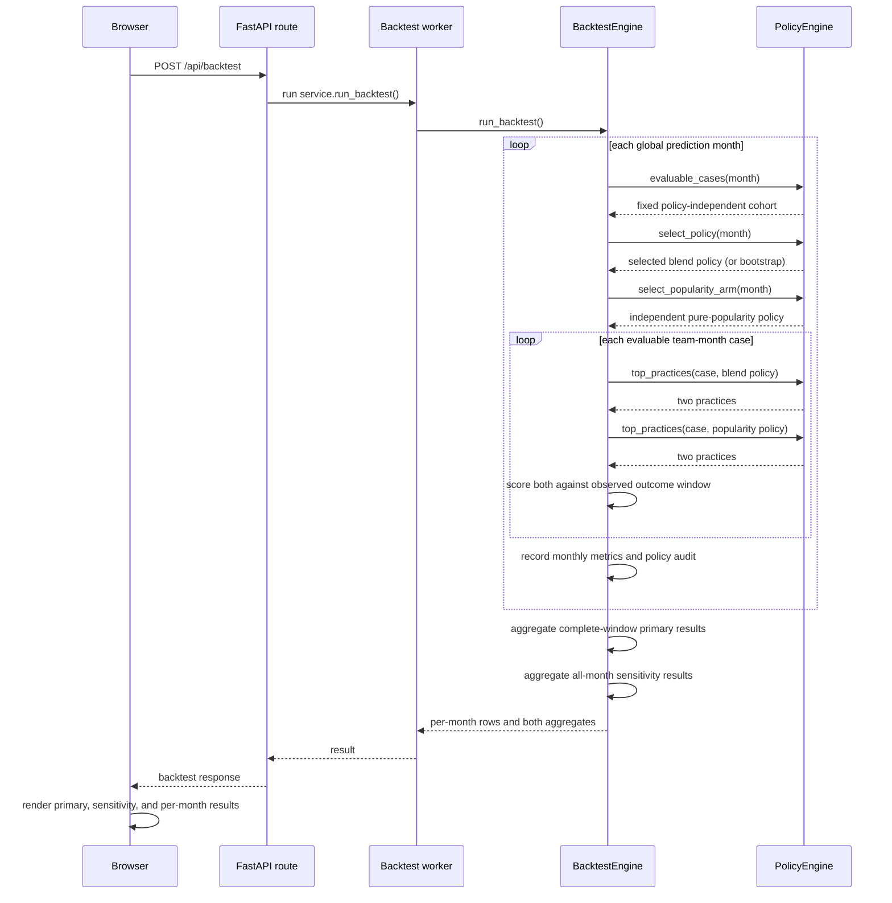

# Flow 2 — Run Backtest Validation

Replays the global two-month blend month by month and compares it with a separately selected,
time-aware-popularity-only arm. There are no user-supplied optimization settings.

**Trigger**: the user clicks **Run Backtest Validation** on the Backtest tab.

## Notes

- The route uses a worker thread so the event loop remains responsive while the calculation runs.
- `evaluable_cases()` establishes the same cohort for all 675 blend candidates and for the
  popularity arm. A policy never controls which cases are counted.
- The blend policy maximizes mean monthly HR@2 across completed earlier months. The comparison arm
  follows the same rule but is restricted to 100% popularity and independently selects only its
  recency weight.
- The result exposes per-month HR@2 for both arms, their difference, supporting rank-aware metrics,
  and separately labelled primary and sensitivity aggregates.
