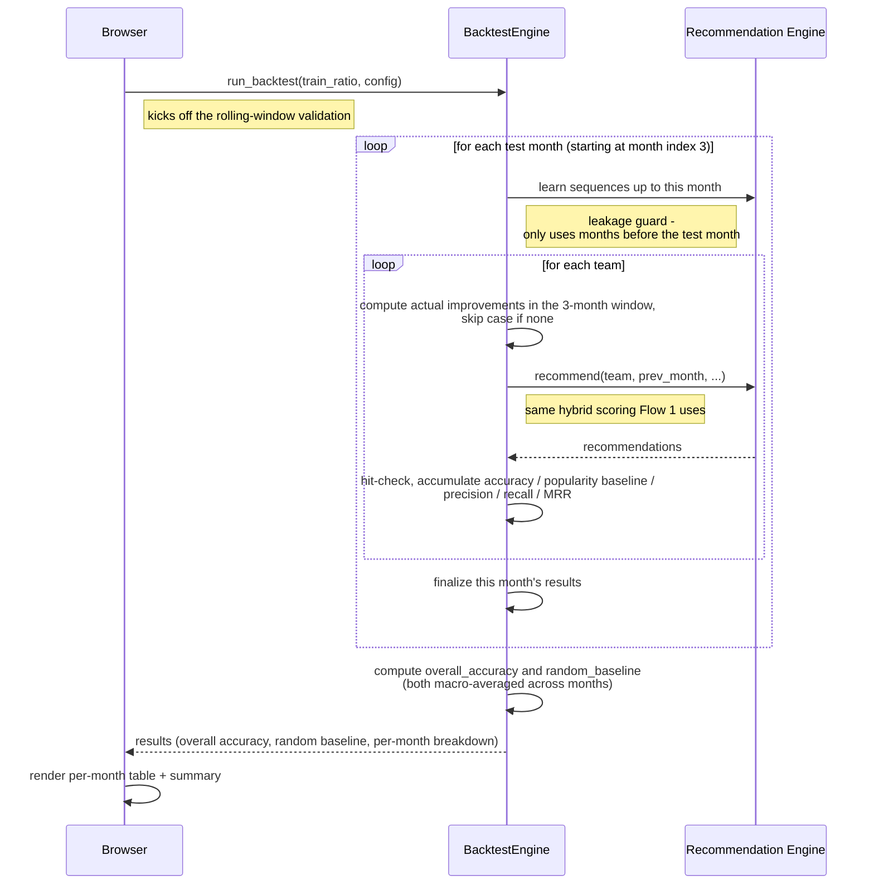

# Flow 2 — Run Backtest Validation

Measures how accurate the recommendation model actually is by replaying history: for every past
month it generates predictions the same way Flow 1 does, then checks them against what teams
really improved. This is UC-02, the analyst's way of validating the model before trusting it.

**Trigger**: user configures parameters (or uses defaults) on the Backtest tab, clicks "Run Backtest."

**Participants**: `Browser` (stands in for the click → app.js → api.js → FastAPI Route →
APIService request/response round trip, collapsed out of this diagram — see notes), plus two
backend modules: `BacktestEngine`, and `Recommendation Engine` — a grouping of
`RecommendationEngine` and `SequenceMapper`, the same pair `BacktestEngine` drives together on
every test month (see notes; this is the same predictor Flow 1 uses).

## Notes

- **Why sequences are learned once per month, but recommendations happen once per team**: the
  sequence step asks a question about the whole dataset — "looking at every team's history up to
  this month, what does a team usually improve next after improving X?" That answer is the same
  for every team being predicted this month, since it only depends on how much history is
  available so far, not on which team you're looking at. So it's worked out once per month and
  then reused. Recommending, on the other hand, is always about one specific team — it needs that
  team's current practice levels, its closest peer teams, and what it personally improved
  recently — so that part has to run separately for each team, using the shared, once-per-month
  answer as one of its ingredients.
- **What "Browser" really stands for**: it's a stand-in for everything that happens between the
  analyst clicking "Run Backtest" and the request actually reaching the backend — the button's
  click handler, the settings getting bundled up, and the request being routed to the right
  backend code. None of that changes how the backtest itself behaves, so it's folded into one box
  to keep the diagram focused on the actual validation logic.
- **Why "Recommendation Engine" is shown as one box, not two**: behind the scenes there are really
  two pieces working together — one that learns "what usually comes next" patterns, and one that
  turns those patterns (plus peer comparisons) into an actual recommendation. They're always used
  together, in the same order, every single time a prediction is needed, so splitting them into
  two boxes wouldn't show any real difference in how they're used — it would just make the diagram
  busier.
- **The two nested loops (months, then teams within each month) are the whole point of this
  diagram** — don't read it as one flat sequence of steps. For every past month being tested,
  every team is checked one by one before moving on to the next month. That nesting is exactly why
  a full backtest can take a while to run: it's re-testing the model many times over, once per
  team per month.
- **The "popularity baseline" comparison is calculated for free** alongside the real predictions —
  while each team's prediction is being checked for a hit, the same information is reused to also
  work out how well a much simpler strategy ("just recommend whatever's popular") would have done.
  No separate pass is needed to compute this comparison.
- **After each month finishes, its results are summarized before moving to the next month.** Once
  every month has been tested, the overall accuracy score and a "random guessing" baseline are
  calculated by averaging across all tested months — these are the two headline numbers shown to
  the analyst at the end.

This description reflects how the backtest currently works — if the underlying logic changes
significantly, this diagram may need to be revisited.
