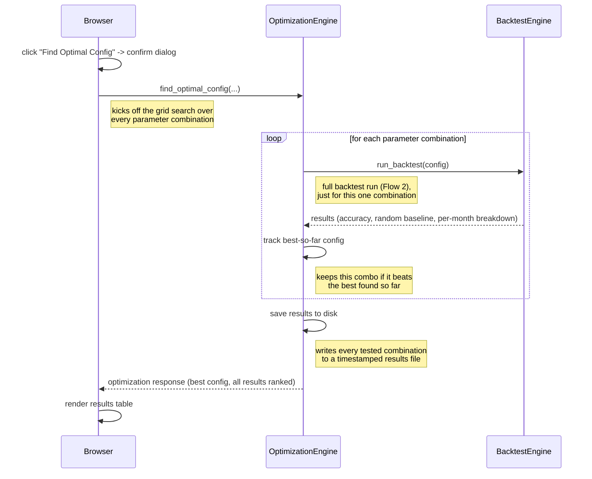

# Flow 3 — Run Parameter Optimization

Searches across combinations of model parameters, running a full backtest (Flow 2) for each one, to
find the configuration with the highest accuracy. This is UC-03, the analyst's way of tuning the
model rather than hand-guessing parameter values.

**Trigger**: user sets parameter ranges on the Optimization panel, clicks "Find Optimal Config."

**Participants**: `Browser` (stands in for the click → app.js → api.js → FastAPI Route → APIService
request/response round trip, collapsed out of this diagram — see notes), plus the backend modules
doing the work: `OptimizationEngine`, `BacktestEngine`.

## Notes

- **Collapsed layer**: `app.js`, `api.js`, `FastAPI Route`, and `APIService` are intentionally left
  out as separate lifelines. `Browser` stands in for that whole round trip: click
  (`app.js:1273`, confirm dialog `:1276-1280`) → `api.js:129-158` (POST `/api/optimize`) →
  `routes.py:161-174` → `APIService.find_optimal_config()` (`service.py:569-578`) →
  `OptimizationEngine.find_optimal_config()` (`optimizer.py:196`). Rendering on completion:
  `displayOptimizationResults()` (`app.js:1357` / `:1498`).
- **Runs in a background thread, not diagrammed here**: `routes.py:161-174` hands the grid search
  off to a persistent, module-level `ThreadPoolExecutor(max_workers=1)` (`routes.py:16`) so the
  FastAPI event loop isn't blocked for the whole run. This diagram keeps to the main
  request/response flow and doesn't depict that threading detail.
- **Cancellation exists but isn't diagrammed here**, to keep the main flow readable. Briefly: the
  UI's "Cancel" button (`app.js:1308`) hits `POST /api/optimize/cancel` → `OptimizationEngine.cancel()`
  (`optimizer.py:95-114`), which sets a flag polled at 4 sites across `optimizer.py` and
  `backtest.py`'s loops; a cancelled run returns partial results instead of the full grid
  (`optimizer.py:436-450`).
- **Two different "results" JSON files exist with similar names** — this diagram depicts only the
  server-side auto-save (`results/optimization_<timestamp>.json`, written by `save_results()`,
  `optimizer.py:453,130-162`). A separate client-side "Download results" button produces a
  differently-named browser download (`optimization_results_<timestamp>.json`, `app.js:1742-1759`)
  that never touches the server's `results/` directory — don't conflate the two.

Citations current as of this session; re-verify against `app.js`, `api.js`, `routes.py`,
`service.py`, `optimizer.py`, `backtest.py` if the implementation changes.
