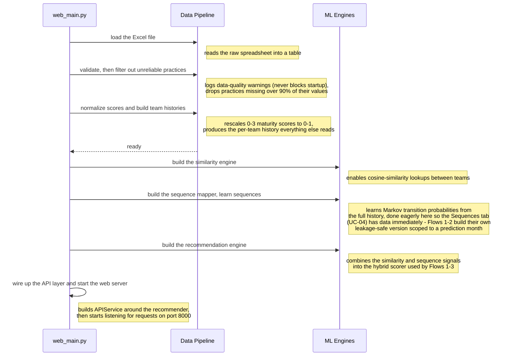

# Flow 4 — System Startup

Loads the Excel dataset, validates and filters it, and builds the ML engines the app depends on,
all before the web server starts accepting requests. It isn't a user-triggered use case, but it
explains why Flows 1-3 can run quickly — the expensive setup work already happened here.

**Trigger**: none — runs once when `web_main.py` starts.

**Participants**: `web_main.py` (the orchestrator — plays the same role `Browser` plays in the other
three flows), plus two grouped backend stages:
- `Data Pipeline` — groups `DataLoader`, `DataValidator`, and `DataProcessor`, which run one after
  another to turn the raw Excel file into a clean, per-team practice-history dataset.
- `ML Engines` — groups `SimilarityEngine`, `SequenceMapper`, and `RecommendationEngine`, the three
  models built from that dataset.

## Notes

- **Why these two groups**: nothing inside the "Data Pipeline" stage or the "ML Engines" stage talks
  back to `web_main.py` mid-step or to each other directly — `web_main.py` constructs each piece and
  hands it to the next, in a straight line. Grouping them keeps this diagram to 3 lifelines instead
  of 7, since the point here is "what gets built, in what order," not call-and-response between
  components (see `docs/PROJECT_DOCUMENTATION.md` §4.1 for the full component breakdown if you need
  the individual class names).
- **Correction vs. a prior claim in `architecture.md`**: the missing-value filter
  (`DataValidator.filter_high_missing_practices()`) does **not** mutate the practices list in
  place — it returns a new, filtered list, and `web_main.py` reassigns its local variable to that.
- **Sequence learning is eager here, lazy everywhere else**: `SequenceMapper.learn_sequences()` runs
  once at startup across the full history — this is the matrix the Sequences tab (UC-04,
  `GET /api/sequences`) displays, so it needs an org-wide, not-month-scoped view available
  immediately. Flows 1-3 never read that startup matrix; they call
  `learn_sequences_up_to_month(max_month)` instead, a leakage-safe variant that rebuilds the
  transition matrix from scratch using only months `< max_month`. Backtest (Flow 2) calls this
  **once per test month** as it walks the rolling window (`backtest.py:253`), producing a separate
  rebuild for every period rather than one build reused across the run; results per `max_month` are
  cached (`_sequence_cache`) so repeat calls for the same month are free.
- `DataValidator.validate()`'s pass/fail result is discarded by `web_main.py` — a failed check only
  produces warning log lines, it never blocks startup.

Citations current as of this session (`web_main.py:173-252`, `src/data/validator.py:27-57,182-218`,
`src/ml/sequences.py:27,121`, `src/validation/backtest.py:253`); re-verify against the code if the
implementation changes.
